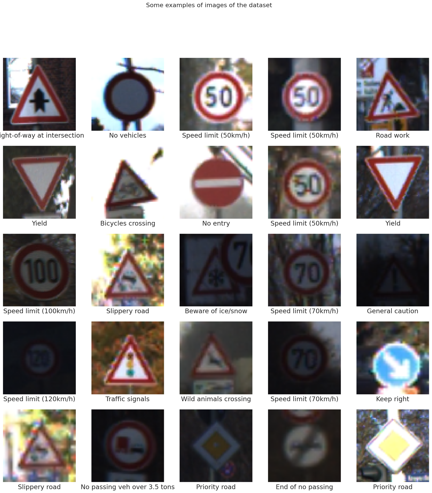
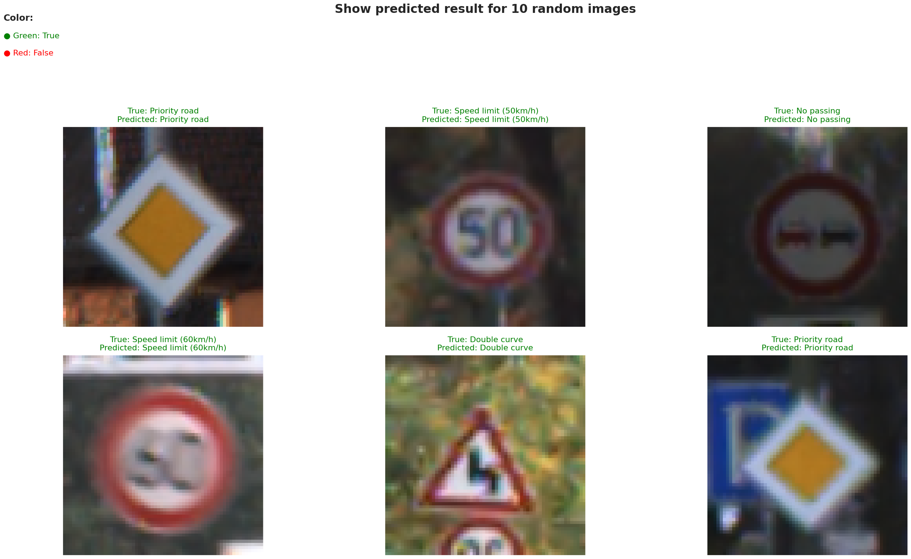

# Traffic-Sign-Recognition-CNN

> Image classification for traffic signs with CNN using the GTSRB dataset.

This repository contains a project for classifying German traffic signs using a Convolutional Neural Network (CNN). The model is built with TensorFlow and Keras and is trained on the German Traffic Sign Recognition Benchmark (GTSRB) dataset to identify 43 different classes of traffic signs.

## About The Project

The goal of this project is to build and train a deep learning model capable of accurately identifying traffic signs from images. This is a crucial task for autonomous driving systems. This implementation uses a Convolutional Neural Network (CNN), which is highly effective for image classification tasks. The notebook provided (`traffic_sign.ipynb`) covers the entire pipeline, from data acquisition and preprocessing to model training and evaluation.

## Dataset

The model is trained on the **German Traffic Sign Recognition Benchmark (GTSRB)** dataset, which was sourced from Kaggle.

- **Dataset Link:** [gtsrb-german-traffic-sign on Kaggle](https://www.kaggle.com/datasets/meowmeowmeowmeowmeow/gtsrb-german-traffic-sign)
- It contains over 50,000 images across 43 different classes.
- The notebook loads 39,209 images for training and 12,630 images for testing.

Below are some samples from the dataset:



## Project Workflow

The notebook `traffic_sign.ipynb` follows these key steps:

1.  **Setup:** Mounts Google Drive and uses the Kaggle API (via an uploaded `kaggle.json`) to download and unzip the dataset.
2.  **Data Loading:** Reads the `Train.csv` and `Test.csv` files to get image paths and their corresponding `ClassId` labels.
3.  **Preprocessing:**
    -   Images come in various sizes. All images are resized to a uniform `(64, 64)` pixel dimension.
    -   Images are converted from BGR (the OpenCV default) to RGB format.
    -   The training data is shuffled to ensure the model doesn't learn from the order of the data.
4.  **Model Building:** A CNN model is defined using the Keras Sequential API.
5.  **Training:** The model is compiled and trained on the preprocessed training images.

## Model Architecture

The model is a sequential CNN built using `tensorflow.keras`. The architecture is as follows:

1.  `Conv2D` 
2.  `Conv2D`
3.  `MaxPool2D` 
4.  `Dropout` 
5.  `Conv2D` 
6.  `Conv2D` 
7.  `MaxPool2D` 
8.  `Dropout` 
9.  `Flatten`
10. `Dense` 
11. `Dropout`
12. `Dense` 

The model is compiled using the `adam` optimizer and `sparse_categorical_crossentropy` as the loss function.

## Results and Performance

The model was trained for 5 epochs with a batch size of 128. It achieved a peak validation accuracy of **96.75%** on the test set.

The image below shows the model's predictions on a random sample of 6 test images. The text is colored green for correct predictions and red for incorrect ones. The model correctly classified all images in this sample.



## How to Run

### 1. Google Colab (Recommended)

1.  Open `traffic_sign.ipynb` in Google Colab.
2.  You will need a Kaggle API token. Download your `kaggle.json` from your Kaggle account settings.
3.  Run the second cell (the one containing `files.upload()`) and upload your `kaggle.json` when prompted.
4.  Run the remaining cells in order. A GPU runtime (`T4`) is recommended for faster training.

### 2. Local Environment

1.  Clone this repository:
    ```bash
    git clone [https://github.com/nimabgr/Traffic-Sign-Recognition-CNN.git](https://github.com/nimabgr/Traffic-Sign-Recognition-CNN.git)
    cd Traffic-Sign-Recognition-CNN
    ```
2.  Install the required libraries. You will need to create a `requirements.txt` file.
    ```
    tensorflow
    numpy
    pandas
    scikit-learn
    seaborn
    matplotlib
    opencv-python
    tqdm
    kaggle
    ```
    Install them using:
    ```bash
    pip install -r requirements.txt
    ```
3.  Make sure your `kaggle.json` file is in the `~/.kaggle/` directory so the Kaggle API can find it.
4.  Run the Jupyter Notebook:
    ```bash
    jupyter notebook traffic_sign.ipynb
    ```
    *Note: You will need to remove or modify the `google.colab` import cells if running locally.*
